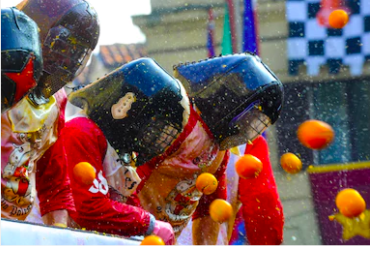

# Déambulation gastronomique augmentée

En association avec la direction artistique du Carnaval des 2 rives de Bordeaux ayant pour thème "le carnaval augmenté", de l’association Arteli et Jean-François André, l'association Gourmandignes et Bénédicte Lambert, créatrice culinaire s'unissent pour proposer un **projet de char consacré à l'alimentation augmentée**.

L'intention est de créer des liens intergénérationnels avec différents acteurs potentiels : les enfants, les adultes, les personnes âgées qui se rencontrent peu habituellement sur des projets d'envergure. **À travers les outils pédagogiques, technologiques et créatifs, la co-construction de cet événement festif va favoriser la transmission, la découverte, le partage, la valorisation et la mise en oeuvre des savoir-faire**.

Attachés aux valeurs du partage, nous proposerons une restitution des ateliers et des étapes de conception et réalisation sous la forme d'une documentation publiée sur Internet assortie d'une licence de libre réutilisation.

Le point d'orgue de ce projet consistera à **accompagner la déambulation du char lors des parades du Carnaval des 2 rives et du Carnaval de Floirac**. A cette occasion, les participants seront invités à interagir avec les spectatrices et les spectateurs en stimulant leurs 5 sens. Odoramat, intéractions ludiques, distributions permettront d'augmenter la parade d'une proposition gustative.

## Qui sommes-nous ?
**AMAP Gourmandignes** : basée à Cenon, l'association Gourmandignes s'emploie depuis 2010 à mettre en relation consommateurs et producteurs locaux pour favoriser l'agriculture biologique et contribuer son accessibilité à tous les publics. Elle propose aux 70 familles adhérentes, 15 productions issues d'agricult.rice.eurs girondins chaque semaine sur le lieu de distribution situé à proximité de la mairie de Cenon. Elle propose également des ateliers culinaires en partenariat avec des centres sociaux de la rive droite animée par des professionnels de la cuisine.

En savoir plus : https://gourmandignes.org

**Bénédicte Lambert, créatrice culinaire** réalise des prestations autour de la gastronomie ; de la création de recettes, des ateliers de découverte ou de design, du stylisme et de l'événementiel.

Scénographe, elle a travaillé une dizaine d'années comme comédienne et marionnettiste. Elle a obtenu son CAP de pâtisserie en candidat libre et est partie l'éprouver au Japon dans un restaurant franco-japonais.

Elle aime jouer avec la nourriture, elle met en scène les aliments pour la photo ou pour l'évènementiel. Bénédicte invente de nouvelles associations et de nouvelles façons de voir ce que l'on mange. C'est une aventurière qui cherche de nouvelles sensations gustatives, de nouvelles histoires, de nouvelles émotions à créer ensemble.

En savoir plus : http://www.benedictelambert.com/

### Précédentes collaborations

En 2018, nous avons participé au Carnaval des 2 rives de Bordeaux sur le thème du "carnaval augmenté" comme le prochain, en proposant un stand de nourritures et de boissons sucrées aux participants du carnaval.
Organisé en partenariat avec le centre social du Grand parc, nous avons imaginé un goûter sucré constitué uniquement à partir de produits issus de l'agriculture locale biologique. Ce stand de vente de nourriture et boissons était augmenté par la forme des friandises proposées et par une scénographie interactive invitant à la découverte de quelques secrets alimentaires.

Nous intervenons également régulièrement lors d'événements festifs sur Cenon pour des fêtes de quartier ou lors d'évènements culturels (Le Tube, Festi Family, Guinguette de Testaud, gratiferia, dîners sur l'herbe) en associant les participant.es à l'élaboration des préparations de recettes.

Depuis 18 mois, nous organisons un cours mensuel de cuisine collaborative en partenariat avec le centre social Didée à Lormont où nous invitons les participant.es à (re-)découvrir des produits simples et sains, principalement issus des producteurs qui coopérent avec l'AMAP.

dépôt de recettes : https://akakeronos.github.io/recettes/

## Propositions d'ateliers

### Publics

* Les élèves de 2 classes des écoles élémentaires de Floirac du REP (Réseau d'éducation prioritaire) Mandela et leurs parents
* Habitants de la RPA de Floirac
* Relais habitants
* Épicerie solidaire

### Organisation
Les ateliers se dérouleront au centre social du bas Floirac.

Ils seront proposés simultanément aux enfants de deux classes de deux écoles du bas Floirac, à leurs parents, aux personnes âgées de la maison de retraite et (aux habitants de Floirac ça me parait trop vaste les habitants de Floirac) de manière à croiser et créer des liens entre des personnes qui ne se connaissent pas forcément.

L’association Gourmandignes et Bénédicte Lambert animeront les ateliers définis ci-dessous.
Ils prendront en charge les deux classes mélangées et réparties en groupes.
Les enseignants prendront en charge les autres groupes et animeront de leurs côtés d’autres ateliers en lien avec la thématique définie.

Afin de favoriser la participation active et la capacité à penser et réaliser collectivement, de développer la créativité et l'implcation dans un projet, **la méthode de design thinking** sera utilisée. Il s'agit d'un processus utilisant des outils qui favorisent l'innovation. Il utilise la co-créativité et le prototypage/les brouillons qui permettent d'affiner les idées et de tester sa faisabilité. Avant de s'appuyer sur la technique et les savoirs, il sera proposé d'ouvrir grand les vannes de la créativité et de l'imagination pour re-serrer ensuite vers des solutions pratiquables.

### Mise en place de l'équipe artistique du Carnaval des 2 rives

* création d'un char spécifique appelé La Bouffe
(lien photos)  
Ce char est conçu et construit par l'équipe du Carnaval des 2 rives de Bordeaux et Guillaumit. Il est entièrement financé par le budget du Carnaval des 2 rives.  
Il est manipulé par des bénvoles. À l'intérieur, il y aura des cuisiniers ainsi que des personnages déguisés à l'extérieur.  
Les participants des ateliers de Floirac seront invités à venir participer à la déambulation, ils revêteront un costume spécifique et reconnaissable, en lien avec le char et les personnages.

### Atelier 1 : design thinking : la gourmandise distribuée
**durée** : 1 demi-journée

Pendant cet atelier de 3 heures, les participant.es sont invitées à imaginer quelle forme sera donnée à la friandise distribuée lors des carnavals.

**déroulé** :
1. accueil des participant.es : un jeu sur les 5 sens est proposé pour dérouter les sensations gustatives : changer la couleur d'un aliment, l'associer à un élément nouveau, ne plus le voir et seulement le toucher ou l'entendre (brise-glace)
2. présentation du projet : présentation des carnavals, visuels de l'édition 2018 du carnaval, présentation de l'idée de char alimentaire orienté vers le thème des sucreries et friandises
3. atelier de brainstorming : identifier les besoins et générer autant d'idées que possible sans les juger (imaginer des choses réalistes ou folles)
4. atelier de conception : par équipe de 4, chaque groupe imagine à l'aide de feuilles, cartons, crayons, ciseaux, colle, matériaux divers, des formes de friandises en lien avec la thématique et la charte graphique du Carnaval. L'idée est d'avoir une forme unique et inédite, inventée par les participants.

En parralèle et en amont, présentation du design culinaire par les enseignants

### Atelier 2 : le sucre, découverte, sensibilisation
**durée** : 1 demi-journée X2 */je ne comprends pas le X2 peut-être faut il l'expliciter ? /*

Pendant cet atelier de 3 heures, les participant.es sont invitées à réfléchir sur la notion d'alimentation augmentée, sur leur propre consommation et sur comment proposer des solutions alternatives

**déroulé** :
1. accueil des participant.es : des aliments sont proposés aux participant.es. Chacun.e en choisit un et le fait goûter les yeux bandés à quelqu'un. (brise-glace)
2. présentation du projet : idées de dispositifs de distributions, visuels de l'édition 2018 du carnaval, présentation de l'idée de char alimentaire orienté vers le thème des sucreries et friandises
3. chacun.e en choisit un et le fait goûter les yeux bandés à quelqu'un. Chacun.e note sur une feuille le nom de l'aliment et son niveau de sucre, son goût et l'appréciation sur une échelle de 1 à 10
4. sensibilisation au sucre : présentation des résultats de la séquence précédente. Discussion autour de la sensation de sucré et échanges sur les aliments naturellement sucrés et ceux augmentés en sucre.
5. procédés de fabrication du sucre
6. quiz sur le sucre.
7. présentation d'alternatives au sucre : les sucres naturels, les aliments au goût sucré
8. échanges autour des pratiques alimentaires et des possibilités de réduction de la quantité de sucré ingérée quotidiennement

En parallèle par les enseignants : le sucre, ses effets sur le corps

### Atelier 3 : essais, tests de recettes de friandises, sucreries
**durée** : 1 demi-journée X2

Pendant cet atelier d'une journée, à partir des idées proposées lors des ateliers précédents, les participant.es sont invitées à tester les recettes lors d'un atelier de fabrication.

**déroulé** :
1. expérimentations : créations à partir des éléments mis à disposition : ingrédients, techniques en lien avec les choix des ateliers précédents (gélification, cuisine moléculaire, cuisson, déshydratation)
2. préparations culinaires : préparation des recettes à partir des expérimentations
3. dégustation et propositions d'améliorations : dégustation des prototypes de recettes conçus par les participant.es et échanges en vue de proposer d'éventuelles améliorations
4. test client : faire goûter à un panel représentatif des participant.es du carnaval et recevoir des retours pour d'autres éventuelles modifications
5. rétrospective pour établir le plan d'action pour la finalisation

En parallèle par les enseignants : loto des odeurs, découverte de plantes aromatiques dans le jardin des cheminots

6. goûter partagé et rétrospective : dégustation d'un goûter et échanges sur l'atelier sous la forme d'une rétrospective.

### Atelier 4 : prototypage de systèmes pour distribution des friandises
**durée** : 1 demi-journée X2

Pendant cet atelier d'une journée les participant.es sont invitées à concevoir des prototypes de moules ou de dispositifs de distribution pour les recettes qui seront proposées lors du carnaval

**déroulé** :
1. atelier de brainstorming : identifier les besoins et générer autant d'idées que possible sans les juger (imaginer des choses réalistes ou folles)
2. atelier de conception : par équipe de 4, chaque groupe imagine à l'aide de feuilles, cartons, crayons, ciseaux, colle, matériaux divers, des dispositifs permettant la distribution de nourriture ou la diffusion d'odeurs alimentaires. L'idée est d'augmenter les sensations du public en jouant sur les odeurs, les saveurs ou l'effet de surprise.

Pendant cet atelier de 3 heures, les participant.es sont invitées à imaginer des dispositifs de distribution de nourriture ou des moules permettant la conception de préparations culinaires. (préconisation de 2 ateliers différents pour les dispositifs et les moules)

### Atelier 5 : réalisation et confection des modes de distribution et diffusion
**durée** : 1 demi-journée x2

**déroulé** :
1. bilan sur les idées retenues
2. par petits groupes, fabrication des dispositifs de diffusion des créations culinaires, décorations. Concernant la distribution, l'idée est de fabriquer des dispositifs qui permettent de distribuer de manière augmentée les aliments aux spectateurs à proximité du char mais également de diffuser des odeurs alimentaires.

### Atelier 6 : Confection, réalisation avant les 2 carnavals
**durée** : 1 journée X2

**déroulé** :
1. finalisation des préparations culinaires et décoration
2. répétitions et tests avec le char et des différents systèmes mis en place

## Partenaires pressentis
L'association Gourmandignes et Bénédicte Lambert souhaitent s'associer à diverses structures locales pour proposer sur leur territoire des ateliers en lien avec l'objet du projet.

* Ville de Floirac
* Écoles de Floirac
* Arteli
* Centre social du Bas Floirac
* Relais Habitants
* Côté sciences
* Épicerie solidaire
* Conseil des sages
* Quartier Génial
* Ehpad
* Jardins des cheminots

Des ateliers et une parade spécifique à la ville de Floirac sont prévus en vue d'une continuité du Carnaval des 2 rives. La réutilisation du char et de certains éléments de la parade permettront de créer un contexte festif adapté à la thématique choisie par le Carnaval de FLoirac.

## Budget prévisionnel

**ateliers** :
*/6 jours gestion de projet pour les séquences d'animation et la coordination des partenaires : 1800 €

5 ateliers : 3 000 €/*

*/ je ne comprends pas les jours er les ateliers différenciés ce n'est pas du tout clair pour moi/*

Le prix habituel d'une intervention d'une journée est de 450€ pour Bénédicte et 350 € pour un animateur Gourmandignes. Afin de minimiser le budget un prix de 600 € par atelier pour 2 intervenant.es pour une journée est proposé.
Ce tarif comprend par exemple l'animation d'un groupe classe de 25 élèves. A ce groupe classe seront associés des personnes provenant d'autres contextes (adolescents, personnes âgées, famille, etc.) Lors de cette journée on peut imaginer 4 séquences de 80 min (4 groupes de 6):
* design : imaginer des idées de moules, de formes, d'emballage ou de distributeur. Réalisation d'une maquette du projet
* goût : découverte de goûts sur la thématique du sucré. Présentation d'une séquence vidéo. Echange sur les pratiques d'alimentation
* cuisine : réalisation d'une recette individuellement ou par groupe de 3
* conception ou réalisation de maquette pour le char

budget prévisionnel = * 14 demi journées d'ateliers pour un budget de 4200€  (Ils couvrent la conception, la coordination et l'animation de 6 ateliers en vue de construire et d'animer la distribution de gourmandises sur un char alimentaire augmenté.
                      * 6 jours de gestion de projet et de coordination du projet par les Gourmandignes et Bénédicte Lambert pour un budget de 1800€

Pour concevoir ce char, permettre des expérimentations lors des ateliers et réaliser les dispositifs de fabrication de recettes et la distribution des denrées préparées lors de la parade:

budget prévisionnel : * prix des matières premières (construction, création, décors, nourriture) pour une distribution de 2500 friandises budget de 2000€

Budget total : 8000€

## Plan de financement

Prestation prise en charge par le carnaval des 2 rives : 2 500 €
Demande de financement à la mairie de Floirac : 2 000 €
Demande de subvention Fondation de France : 3 500 €
